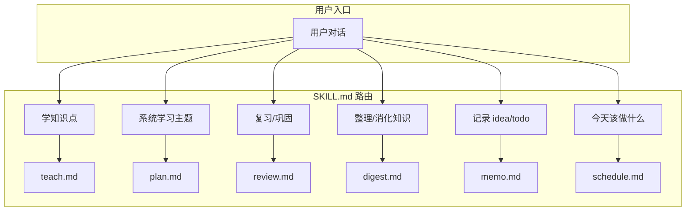
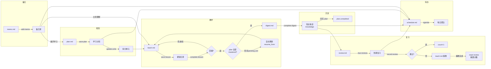
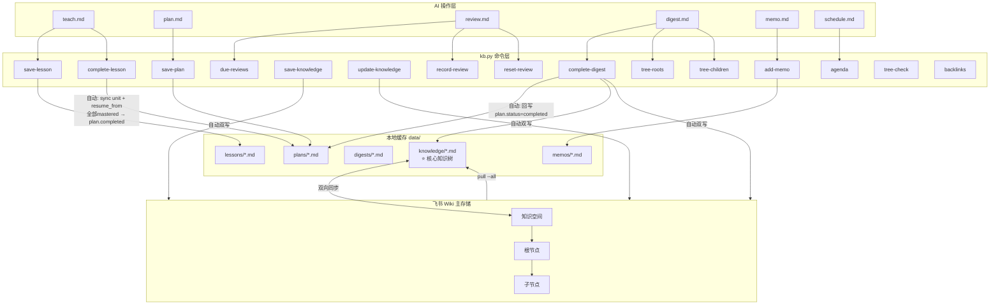
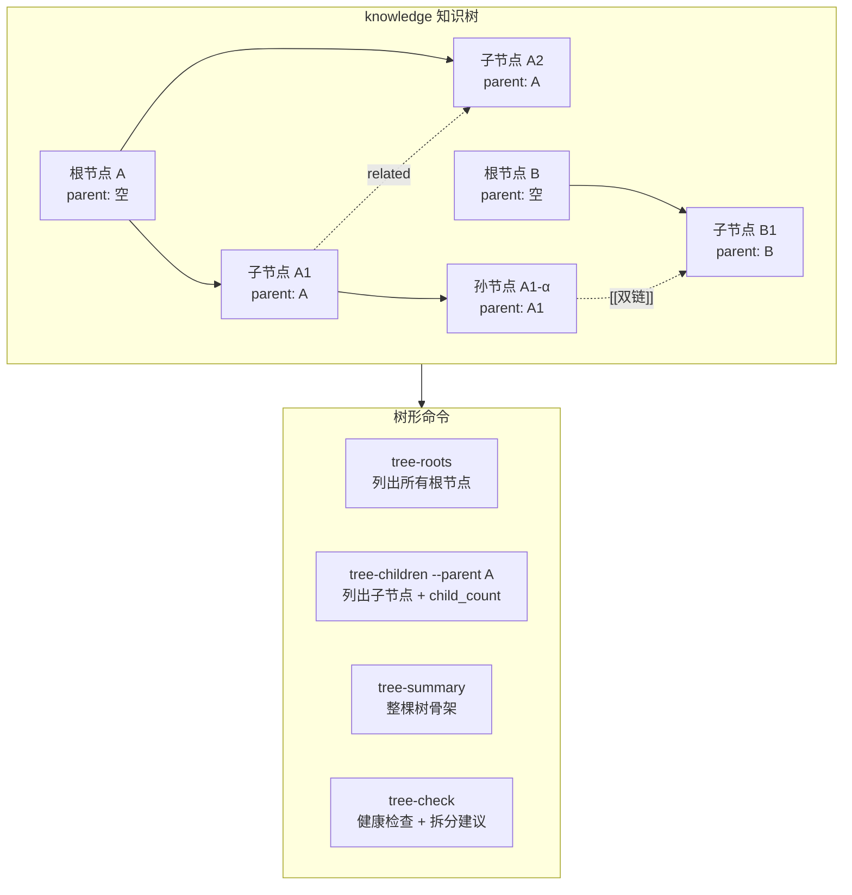
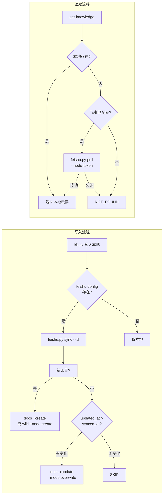
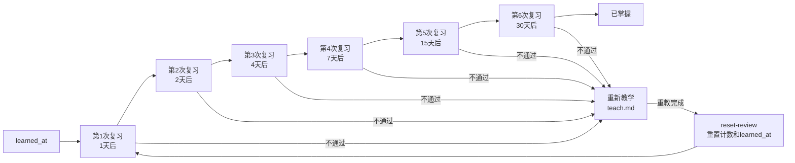
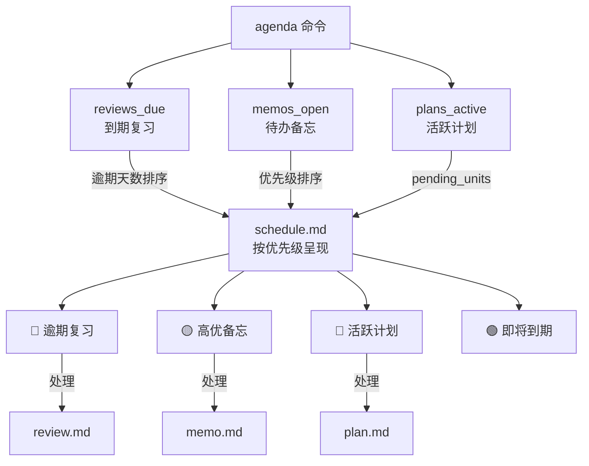
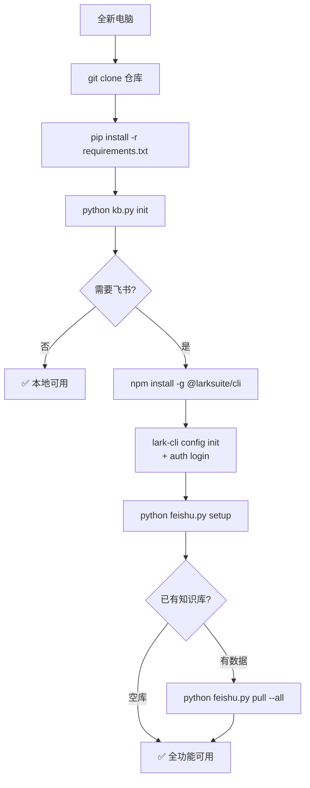

# knowledge-system 完整流程图

## 系统架构总览

```mermaid
graph TB
    subgraph 用户入口
        U[用户对话]
    end

    subgraph 路由层["SKILL.md 路由"]
        R1["学知识点"] --> teach.md
        R2["系统学习主题"] --> plan.md
        R3["复习/巩固"] --> review.md
        R4["整理/消化知识"] --> digest.md
        R5["记录 idea/todo"] --> memo.md
        R6["今天该做什么"] --> schedule.md
    end

    U --> R1 & R2 & R3 & R4 & R5 & R6
```

## 学习生命周期

```mermaid
flowchart LR
    subgraph 规划
        P1[plan.md] -->|save-plan| P2[学习计划]
        P2 -->|update-units| P3[拆分单元]
    end

    subgraph 教学
        T1[teach.md] -->|save-lesson| T2[课堂记录]
        T2 -->|complete-lesson| T3{掌握?}
        T3 -->|是| T4{plan 全部<br/>mastered?}
        T4 -->|是| D1
        T4 -->|否,有pending unit| T5[自动更新<br/>resume_from]
        T3 -->|否,继续| T1
    end

    subgraph 沉淀
        D1[digest.md] -->|complete-digest| D2[知识条目<br/>knowledge]
        D2 -->|回写 plan| D3[plan.completed]
    end

    subgraph 复习
        V1[review.md] -->|due-reviews| V2[到期复习]
        V2 -->|record-review| V3{通过?}
        V3 -->|是| V4[count+1]
        V3 -->|否| V5[teach.md 重教]
        V5 -->|重教完成| V6[reset-review<br/>重置计数]
    end

    subgraph 待办
        S1[schedule.md] -->|agenda| S2[每日聚合]
    end

    P3 --> T1
    T5 --> T1
    D2 --> V1
    V2 --> S1
    D2 --> S1
    P2 --> S1

    subgraph 备忘
        M1[memo.md] -->|add-memo| M2[备忘录]
    end

    M2 -->|展开学习| P1
    M2 -->|立刻理解| T1
    M2 --> S1
```

## 数据流与存储

```mermaid
flowchart TB
    subgraph AI["AI 操作层"]
        AI_TEACH[teach.md]
        AI_PLAN[plan.md]
        AI_REVIEW[review.md]
        AI_DIGEST[digest.md]
        AI_MEMO[memo.md]
        AI_SCHEDULE[schedule.md]
    end

    subgraph CLI["kb.py 命令层"]
        C_SAVE_PLAN[save-plan]
        C_SAVE_LESSON[save-lesson]
        C_COMPLETE_LESSON[complete-lesson]
        C_COMPLETE_DIGEST[complete-digest]
        C_SAVE_KNOWLEDGE[save-knowledge]
        C_UPDATE_KNOWLEDGE[update-knowledge]
        C_DUE_REVIEWS[due-reviews]
        C_RECORD_REVIEW[record-review]
        C_RESET_REVIEW[reset-review]
        C_ADD_MEMO[add-memo]
        C_AGENDA[agenda]
        C_TREE_ROOTS[tree-roots]
        C_TREE_CHILDREN[tree-children]
        C_TREE_CHECK[tree-check]
        C_BACKLINKS[backlinks]
    end

    subgraph LOCAL["本地缓存 data/"]
        D_PLANS["plans/*.md"]
        D_LESSONS["lessons/*.md"]
        D_DIGESTS["digests/*.md"]
        D_KNOWLEDGE["knowledge/*.md<br/>⭐ 核心知识树"]
        D_MEMOS["memos/*.md"]
    end

    subgraph FEISHU["飞书 Wiki 主存储"]
        F_SPACE["知识空间"]
        F_ROOT["根节点"]
        F_CHILD["子节点"]
        F_SPACE --> F_ROOT --> F_CHILD
    end

    AI_TEACH --> C_SAVE_LESSON --> D_LESSONS
    AI_TEACH -->     C_COMPLETE_LESSON -->|自动: sync unit + resume_from<br/>全部mastered → plan.completed| D_PLANS
    C_COMPLETE_DIGEST -->|自动: 回写 plan.status=completed| D_PLANS
    AI_PLAN --> C_SAVE_PLAN --> D_PLANS
    AI_DIGEST --> C_COMPLETE_DIGEST --> D_KNOWLEDGE
    AI_REVIEW --> C_DUE_REVIEWS
    AI_REVIEW --> C_RECORD_REVIEW
    AI_REVIEW --> C_RESET_REVIEW
    AI_MEMO --> C_ADD_MEMO --> D_MEMOS
    AI_SCHEDULE --> C_AGENDA
    AI_DIGEST --> C_TREE_ROOTS & C_TREE_CHILDREN

    C_COMPLETE_DIGEST -->|自动双写| FEISHU
    C_SAVE_KNOWLEDGE -->|自动双写| FEISHU
    C_UPDATE_KNOWLEDGE -->|自动双写| FEISHU

    FEISHU -->|pull --all| D_KNOWLEDGE
    D_KNOWLEDGE <-->|双向同步| F_SPACE
```

## 知识树结构

```mermaid
flowchart TB
    subgraph TREE["knowledge 知识树"]
        ROOT1["根节点 A<br/>parent: 空"]
        ROOT2["根节点 B<br/>parent: 空"]
        CHILD1["子节点 A1<br/>parent: A"]
        CHILD2["子节点 A2<br/>parent: A"]
        CHILD3["子节点 B1<br/>parent: B"]
        GRAND1["孙节点 A1-α<br/>parent: A1"]
    end

    ROOT1 --> CHILD1 & CHILD2
    ROOT2 --> CHILD3
    CHILD1 --> GRAND1

    CHILD1 -.->|related| CHILD2
    GRAND1 -.->|"[[双链]]"| CHILD3

    subgraph COMMANDS["树形命令"]
        TR["tree-roots<br/>列出所有根节点"]
        TC["tree-children --parent A<br/>列出子节点 + child_count"]
        TS["tree-summary<br/>整棵树骨架"]
        TK["tree-check<br/>健康检查 + 拆分建议"]
    end

    TREE --> COMMANDS
```

## 飞书同步机制

```mermaid
flowchart LR
    subgraph WRITE["写入流程"]
        W1[kb.py 写入本地] --> W2{feishu-config<br/>存在?}
        W2 -->|是| W3[feishu.py sync --id]
        W2 -->|否| W4[仅本地]
        W3 --> W5[新条目?]
        W5 -->|是| W6[docs +create<br/>或 wiki +node-create]
        W5 -->|否| W7{updated_at ><br/>synced_at?}
        W7 -->|有变化| W8[docs +update<br/>--mode overwrite]
        W7 -->|无变化| W9[SKIP]
    end

    subgraph READ["读取流程"]
        R1[get-knowledge] --> R2{本地存在?}
        R2 -->|是| R3[返回本地缓存]
        R2 -->|否| R4{飞书已配置?}
        R4 -->|是| R5[feishu.py pull<br/>--node-token]
        R4 -->|否| R6[NOT_FOUND]
        R5 -->|成功| R3
        R5 -->|失败| R6
    end
```

## 复习调度（遗忘曲线）

```mermaid
flowchart LR
    LEARN[learned_at] --> R1["第1次复习<br/>1天后"]
    R1 --> R2["第2次复习<br/>2天后"]
    R2 --> R3["第3次复习<br/>4天后"]
    R3 --> R4["第4次复习<br/>7天后"]
    R4 --> R5["第5次复习<br/>15天后"]
    R5 --> R6["第6次复习<br/>30天后"]
    R6 --> MASTERED[已掌握]

    R1 & R2 & R3 & R4 & R5 & R6 -->|不通过| RETEACH[重新教学<br/>teach.md]
    RETEACH -->|重教完成| RESET[reset-review<br/>重置计数和learned_at]
    RESET --> R1
```

## 每日待办聚合

```mermaid
flowchart TB
    AGENDA["agenda 命令"] --> A1["reviews_due<br/>到期复习"]
    AGENDA --> A2["memos_open<br/>待办备忘"]
    AGENDA --> A3["plans_active<br/>活跃计划"]

    A1 -->|逾期天数排序| SHOW["schedule.md<br/>按优先级呈现"]

    A2 -->|优先级排序| SHOW
    A3 -->|pending_units| SHOW

    SHOW --> P1["🔴 逾期复习"]
    SHOW --> P2["🟡 高优备忘"]
    SHOW --> P3["🔵 活跃计划"]
    SHOW --> P4["🟢 即将到期"]

    P1 -->|处理| review.md
    P2 -->|处理| memo.md
    P3 -->|处理| plan.md
```

## 冷启动流程

```mermaid
flowchart TB
    START[全新电脑] --> S1[git clone 仓库]
    S1 --> S2[pip install -r requirements.txt]
    S2 --> S3[python kb.py init]
    S3 --> S4{需要飞书?}
    S4 -->|否| READY[✅ 本地可用]
    S4 -->|是| S5[npm install -g @larksuite/cli]
    S5 --> S6[lark-cli config init<br/>+ auth login]
    S6 --> S7[python feishu.py setup]
    S7 --> S8{已有知识库?}
    S8 -->|有数据| S9[python feishu.py pull --all]
    S8 -->|空库| READY2[✅ 全功能可用]
    S9 --> READY2
```
